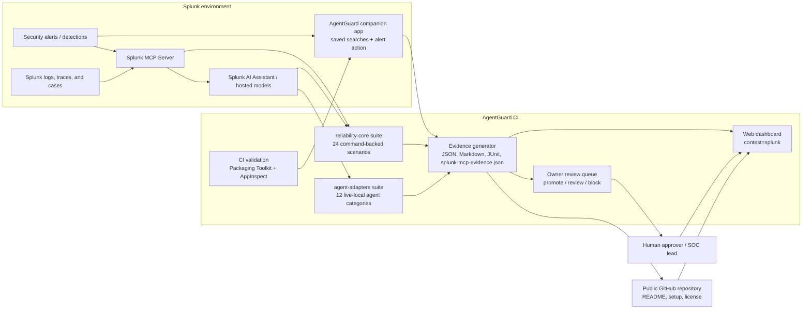

# AgentGuard CI Splunk Architecture Diagram

This root-level architecture diagram satisfies the Splunk Agentic Ops Hackathon repository requirement for `architecture_diagram.(md|pdf|png)`.

## How It Works

1. Splunk detections, alerts, or case context are exposed through Splunk MCP Server, Splunk AI capabilities, and a companion app with saved searches plus a custom alert action.
2. AgentGuard runs reliability scenarios that test whether an AI agent can investigate, summarize, or automate safely.
3. The scoring layer checks goal fidelity, tool boundary, evidence integrity, state safety, and human approval.
4. The reporting layer emits machine-readable and judge-readable artifacts, including `splunk-mcp-evidence.json` and the companion-app review envelope.
5. CI validates the Splunk app package through Packaging Toolkit and AppInspect before the dashboard or demo flow is shipped.
6. The dashboard shows whether the agent should be promoted, routed to review, or blocked before it can mutate external systems.

## Splunk Hackathon Fit

- **Track:** Security
- **Bonus target:** Best Use of Splunk MCP Server
- **AI integration:** Splunk AI Assistant, MCP-mediated tool use, and a companion app for search-to-review handoff
- **Evidence flow:** Splunk context in, AgentGuard reliability evidence and review envelopes out
