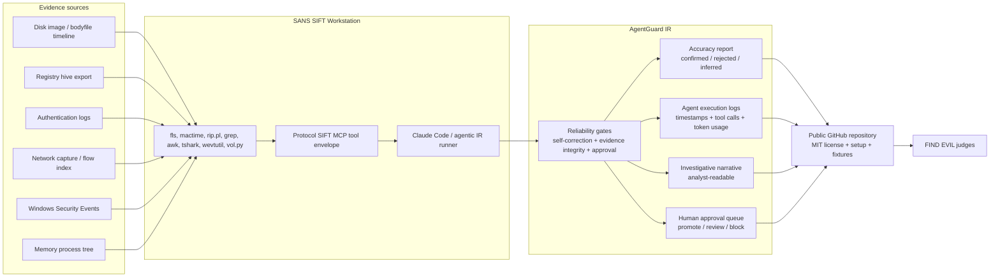

# AgentGuard IR SANS FIND EVIL Architecture Diagram

This root-level architecture diagram is the SANS FIND EVIL view of AgentGuard IR.

## How It Works

1. Evidence sources enter a SIFT-compatible analysis path: disk timeline, registry export, authentication log, network flow index, Windows Security Events, and memory process tree.
2. The agentic runner uses a Protocol SIFT-style tool envelope so every tool call can be logged and replayed.
3. AgentGuard checks whether the agent corrected weak claims, preserved artifact locators, separated confirmed facts from inference, and avoided unsafe containment.
4. The output pipeline writes `agent-execution-log.jsonl`, `accuracy-report.json`, `evidence-dataset.md`, `investigative-narrative.md`, `judge-evidence-summary.md`, and SANS-mode `sift-ir-evidence.json` packets.
5. Judges can run `npm run sans:check` to regenerate and validate the evidence bundle locally.

## FIND EVIL Fit

- **Autonomous execution:** tool-call log plus self-correction event.
- **IR accuracy:** confirmed, rejected, and inferred findings with exact artifact locators.
- **Breadth and depth:** disk persistence, authentication-log accuracy, containment approval, Windows Event Log lateral movement, and memory process tree review routes.
- **Audit trail quality:** timestamped execution log with token usage and replayable evidence paths.
- **Usability:** public MIT repository, safe fixtures, and one-command verification.
